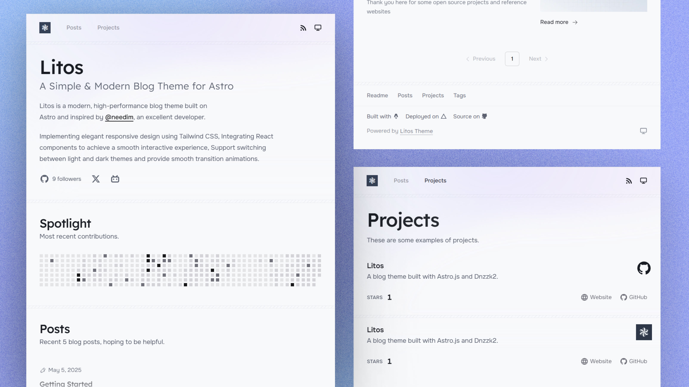

# 🌟 Litos 主题

一个为内容创作者和开发者精心打造的现代、优雅的Astro主题。

## ✨ 核心特性

### 📱 响应式设计

- 流畅的布局，可以无缝适应各种设备
- 在所有屏幕尺寸上优化的阅读体验

### 🎨 内容展示

- 多种文章布局（16:9、3:4、无图片）
- 动态图片处理，具有缩放功能
- 清晰的排版，可自定义样式

### ⚡ 性能表现

- 优化资源，实现快速页面加载
- 内置图片优化
- 最小化JavaScript使用

### 🛠️ 开发者体验

- VS Code代码片段，快速创建内容
- 结构化的内容组织
- 类型安全的内容集合

### 📦 内置功能

- 🏷️ 基于标签的导航
- 📊 阅读时间估计
- 🔍 SEO优化
- 🌓 深色/浅色模式
- 📱 社交媒体预览

### 🎯 内容焦点

- 无干扰的阅读体验
- 多种内容布局
- 代码语法高亮
- 响应式图片画廊
